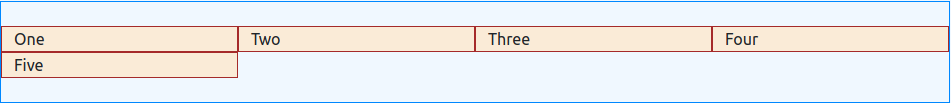

Bootsrap 5
==========

Bootstrap 5 is simple css framework which is developed by twitter. It is mobile first framework.Now I already learn about bootstrap basic and write documentation for me.This documentation only write for me.:blush:

***Index***
+ [Container](#container)
+ [Break Point](#BreakPoint)
+ [Grid Basic](#GridBasic)
+ [Typography](#typography)
+ [Colors](#color)
+ [Tables](#tables)
+ [Images](#images)
+ [Alert](#alert)
+ [Buttons](#buttons)
+ [Buttons Group](#ButtonsGroup)
+ [Badges](#badges)
+ [Progress Bars](#ProgressBars)
+ [Spinners](#spinners)
+ [Pagination](#pagination)
+ [List Groups](#ListGroups)
+ [Cards](#cards)
+ [Dropdowns](#dropdowns)
+ [Collapse](#collapse)
+ [Navs](#navs)
+ [Navbar](#navbar)
+ [Forms](#forms)
+ [Input](#input)
+ [Input Groups](#inputGroups)
+ [Carousel](#carousel)
+ [Modal](#modal)
+ [Tooltip](#tooltip)
+ [Popover](#popover)
+ [Toast](#toast)
+ [Scrollspy](#scrollspy)
+ [Utilities](#utilities)
+ [Flex](#flex)

## Container

Bootstrap has 2 type of container class ableable.

1. container
2. container fluid

### container class
container class provide responsive fixed width container. 

*Code:*

```html
<div class="container text-light">
    Container
</div>
```

*Result:*


*container with breakpoints*
```html
<div class="contaner-sm"></div>
<div class="contaner-md"></div>
<div class="contaner-lg"></div>
<div class="contaner-xl"></div>
<div class="contaner-xxl"></div>
```

### container-fluid class
container fluid take the whole width of viewports every breakpoints

*Code:*
```html
<div class="container-fluid">
Container Fluid
<div>
```

*Result:*


## BreakPoint

Breakpoints are customizable widths that determine how your responsive layout behaves across device or viewport sizes in Bootstrap.

**Bootstrap has 7 type of break point**

1. ExtraSmall(xm) <576px
2. Small(sm) >= 576px
3. Medium(md) >= 768px
4. Large(lg) >= 992px
5. Extra Large(xl) >= 1200px
6. Extra Extra Large(xxl) >= 1400px

## GridBasic

If you add row class inside the div class then it work like grid. Then you add div like column inside the row. Every row divide the 12 part. That means every row contains maximums 12 column. Every column add col class. In Grid system need class :-

***Class Name:***

+ row
+ row-cols-(col number 1 to 12)
+ col
+ col-auto 
+ col-(col size 1-12)
+ col-(break point)+(col size 1-12)
+ offset-(number)
+ order
+ gutter

*Grid system in one picture:-*


#### <ins>Row Class:</ins>

If it add the mother div then it work like grid system.

```html
<div class='container'>
    <div class="row"></div>
</div>
```

#### <ins>row-cols-(cols number)</ins>
it define how many cols in every line. Maximum 12 column in one line.

```html
<div class="container">
    <div class="row row-cols-4">
        <div class="col">One</div>
        <div class="col">Two</div>
        <div class="col">Three</div>
        <div class="col">Five</div>
        <div class="col">Six</div>
    </div>
</div>
```

*Result:*



*Add breakpoint with row-cols.like

    row-cols-(beakpoint)-(cols number);

#### <ins>col:</ins>
create column inside the row div. 

##### <ins>Col-(1-12)</ins>
Define the size it self 1 to 12. Use it with breakpoint

    col-(breakpoint)-(col size)

#### <ins>col-auto</ins>
Remove default col width and height.

#### <ins>Offset:</ins>
Offest class skip first column size.

    offset-(size 1 to 11)

#### <ins>order:</ins>
Ordering the div. 

+ order-last => it ordering div at last
+ order-first => it ordering div at first
+ order-(order number)

#### <ins>gutter:</ins>
Add padding between inside row x axis and margin between row

